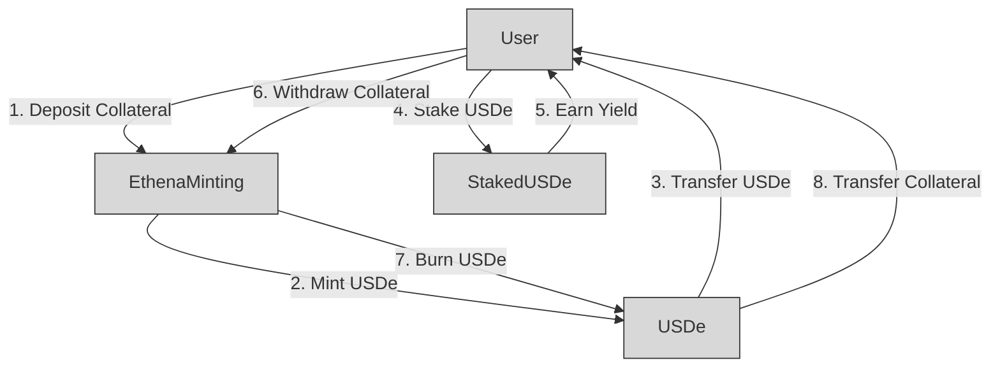

Ethena Labs is building an algorithmic stablecoin protocol that mints USDe stablecoins against collateral assets deposited by users. The protocol consists of smart contracts for USDe minting, redeeming, and staking with yield distribution. 

## Approach

I reviewed the core protocol contracts in the provided codebase including USDe, EthenaMinting, StakedUSDe, and related interfaces and utilities. I analyzed the architecture, control flow, access controls, trust assumptions, and potential risk vectors.

## Architecture 

The protocol follows a modular architecture with well-defined contract interfaces and separation of concerns. Key components:

- **USDe** - ERC20 stablecoin with minting restricted to approved minter
- **EthenaMinting** - Performs minting and redeeming of USDe against collateral 
- **StakedUSDe** - Allows staking USDe and earning yield

Diagram depicting the high-level architecture flow for the Ethena protocol:

The core flow:

1. User deposits collateral to EthenaMinting
2. EthenaMinting mints USDe stablecoins and transfers to User 
3. User stakes USDe in StakedUSDe to earn yield over time
4. When ready, User withdraws collateral by burning USDe
5. EthenaMinting burns USDe from User
6. Collateral transferred back to User

The modular architecture with clearly separated concerns allows the protocol to remain flexible and interoperable.

## Code Quality

The codebase follows best practices and high quality standards overall:

- Well commented with natspec documentation
- Use of OpenZeppelin contracts for trust minimization 
- Explicit interface definitions
- Modular design and separation of concerns
- Detailed events for transparency

## Centralization Risks

Some centralization risks were identified:

- **Minter control** - USDe minting is centralized to a single minter address
- **Admin keys** - Admin roles like pausing allow strong control

## Recommendations

- **Decentralize minter** - Use a DAO or minter set for mint approvals
- **Timelock admin roles** - Add timelock to admin control like pausing 

## Mechanism Analysis

The protocol's core mechanisms were analyzed and found to follow sound practices.

- **Collateralization** - USDe is minted at safe collateral ratios
- **Staking** - Unbonds over time to prevent illiquidity risks
- **Yield distribution** - Smart contract controls fund allocations

## Possible Improvements

- Allow social yield contribution instead of only staking
- Implement better DEX integration and liquidations

## Conclusion

Overall the protocol follows excellent practices but remains a centralized first iteration. Decentralizing control and governance will be key to securing a robust long-term protocol.

### Time spent:
25 hours