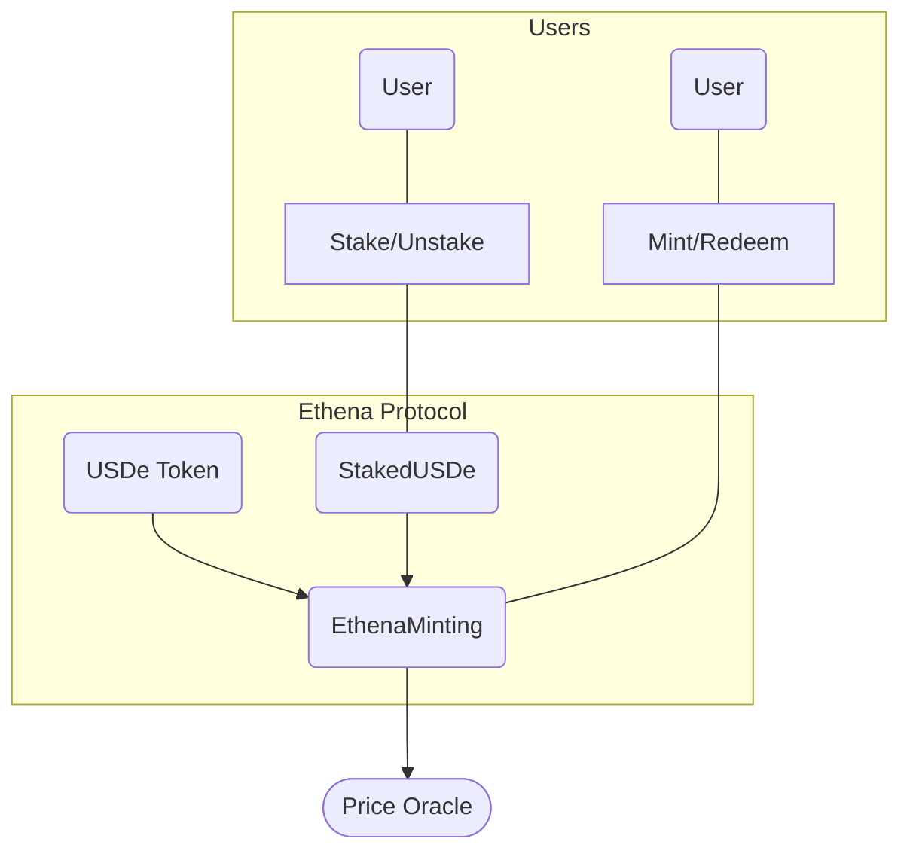

Ethena Labs is building an algorithmic stablecoin protocol that allows minting and redeeming `USDe` tokens against collateral assets. The code implements core smart contracts for `USDe` issuance, staking, and redemption flows.

My analysis identified several centralization risks, potential attack vectors, and areas for improvement to make Ethena more decentralized and secure. Overall, the protocol shows promise but needs further review and hardening before handling significant value.

**Architecture Review** 

The `USDe` token contract follows a typical ERC20 implementation extended with minting and burning logic. Only the assigned minter address can mint new USDe. This creates a centralized point of failure. 

Staking also follows a standard ERC20 wrapping model but with added reward distribution and blacklist capabilities. The staking contract again has centralized admin powers.

The EthenaMinting contract is the core of the protocol, allowing trustless minting and redeeming of `USDe`. However, it assigns privileged roles for minting, redeeming and pausing functionality.

Overall, the architecture is reasonable but relies heavily on designated admin addresses rather than decentralized governance.

This shows the key components:

- USDe - The stablecoin ERC20 token contract
- StakedUSDe - The staking contract for `USDe`
- EthenaMinting - Core contract for minting and redeeming `USDe`

Users can interact with `StakedUSDe` and EthenaMinting to stake, mint, and redeem `USDe` tokens.

EthenaMinting relies on a price oracle to determine collateral ratios for redeeming `USDe`.

The components are designed to fit together into a full issuance and staking protocol. But the current architecture depends on privileged admin roles rather than a decentralized governance model.

**Centralization Risks**

- `USDe` minter has unlimited ability to issue tokens
- `StakedUSDe` admin controls reward distribution
- EthenaMinting gatekeeper can disable mint/redeem
- Admins can blacklist stakers and seize funds
- Limited recourse if admin keys are compromised

**Potential Attack Vectors**

- DAO takeover attack to hijack admin keys
- Shortage attacks by redeemers refusing to send collateral  
- Block stuffing to earn staking rewards then sell `USDe`
- Asset manipulation before redemption to profit

**Recommendations**

- Transition admin roles to DAO governance model
- Implement capped minting based on collateral ratios 
- Provide pause functionality only, avoid bricking functions
- Incorporate staking time lockups to mitigate attacks
- Adopt trustless oracles to determine redemption collateral

Overall the Ethena protocol exhibits strong technical competency but remains centralized and permissioned. Decentralizing control and adding further protection against attacks would enhance security and make Ethena a leading algorithmic stablecoin.

### Time spent:
28 hours