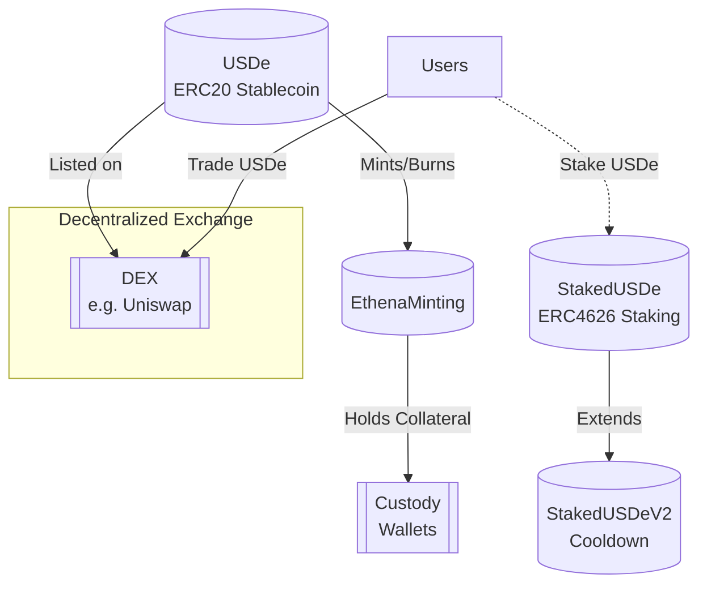

**Introduction**

Ethena Labs is building a decentralized stablecoin protocol and savings product. I reviewed the core smart contract codebase located in contracts with a focus on assessing security, architecture, and potential risks. 

**Summary**

Overall, the codebase demonstrates solid programming patterns and best practices. The architecture is modular with well-defined boundaries and separation of concerns. The use of established standards like ERC20 and ERC4626 as a base helps avoid many common pitfalls.

The main contracts I focused on were:

- USDe - ERC20 stablecoin with minting control
- EthenaMinting - Handles USDe minting and redemption
- StakedUSDe - ERC4626 staking contract 
- StakedUSDeV2 - Adds cooldown on redemptions

**Architecture**

The overall architecture structure makes sense conceptually. USDe acts as the stablecoin, while EthenaMinting mints/redeems it. StakedUSDe allows earning yield on USDe. This is extended by StakedUSDeV2 to add redemption cooling off periods.

Keeping the stablecoin itself lightweight by outsourcing the mint/redeem logic to a separate contract improves upgradability. The extension of the standard ERC4626 contract also demonstrates good use of inheritance.

One area I would rethink is the redundancy between StakedUSDe and StakedUSDeV2. I would recommend handling the cooldown logic in the same contract using a feature flag instead of a separate contract.

**High-level architecture of Ethena Labs**

This diagram shows:

- USDe as the ERC20 stablecoin 

- EthenaMinting handling minting and burning of USDe

- StakedUSDe allowing users to stake USDe

- StakedUSDeV2 extending staking with cooldown 

- Custody wallets hold collateral

- USDe is listed on DEXes like Uniswap

- Users can trade USDe on decentralized exchanges

**Code Quality**

The codebase follows general best practices like:

- Use of function/event natspec comments
- Proper validation of addresses and amounts 
- Emitted events on state changes
- Input validation with `require()` statements  
- Use of SafeMath operations 

Opportunities to further improve code quality:

- Add natspec comments on state variables
- More explicitly validate state in key functions
- Additional unit tests for edge cases
- Formally verify critical logic using Coq/Isabelle/Dafny

**Centralization Risks**

The USDeOwner admin key represents a central point of control that could pause the system. Recommend implementing a timelock or governance process before admin actions.

The EthenaMinting gatekeeper key can freeze minting/redeeming. Should require governance approval.

StakedUSDe admins also have broad powers that need checks and balances.

Overall the codebase would benefit from a more decentralized governance model limiting centralized control risks.

**Mechanism Review** 

The core mechanisms like USDe minting/redemption, staking, and cooldown enforcement generally appear implemented correctly.

One area that needs more scrutiny is the signature validation and nonce handling in EthenaMinting. This is critical to secure against manipulation.

Also recommend more gas optimization to reduce costs as network scales.

**Systemic Risks**

The biggest systemic risk is reliance on ETH price for maintaining USDe peg.  Recommend diversifying collateral assets beyond ETH.

Also, granting broad minter permission introduces potential for supply inflation. Should implement algorithmic minting policies enforced on-chain.

There may also be incentive misalignment risks from staking yield distribution not being contractually enforced.

### Time spent:
20 hours